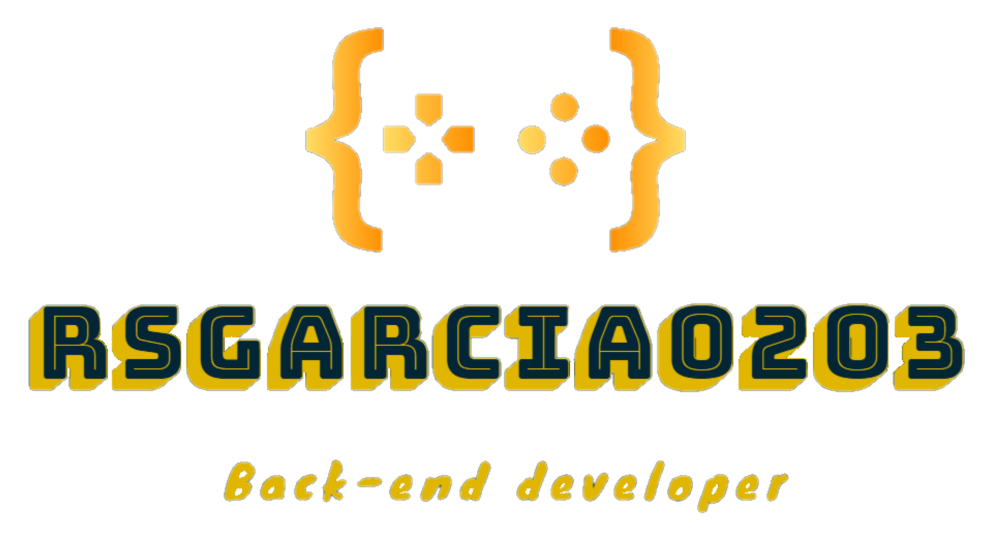

<h1 align="center">Hi , I'm Ronny García</h1>

  
  <h3 align="center">I am passionate about building accessible, user-friendly websites and web applications.</h3>

 

## **🙋‍♂️ About Me**

Hi, I am Ronny García. Current back-end developer freelance from Ecuador. I spend my time on personal projects and learning more about back-end and how to improve my skills. I am passionate about building accessible, user-friendly websites and web applications. My skills include HTML, CSS, Java, Python, GIT, Github, Netlify. However, I am constantly learning and am open to new technologies. If you think I would be a great fit for your team feel free to contact me so we can chat.

- 💼 Full Stack developer 

- 🔭 I’m currently working on becoming a Full Stack Developer.

- 📈 Design and management of databases, development of web pages and writer applications

- 🌱 I’m currently learning **Django** and **Typescript**, and always learning **Java.**

- ❤️ My favorite languages are Java and Python, I like to experiment with the python opencv library to design new projects

- 👯 I’m looking to collaborate on **Web Development projects**

<!-- - 👨‍💻 All of my projects are available at **[My Portfolio](https://subhamraoniar.com)** -->

- 💬 Ask me about anything [here](https://github.com/rsgarcia0203/rsgarcia0203/issues)

- 📫 How to reach me: **rsgarcia@espol.edu.ec**

 

## Skills
- 👨‍💻 TypeScript, JavaScript, Node, PHP, C#, Go, Python, Java
- ⚙️ React, Redux, Angular, Express, Nest.JS, Laravel, Symfony, Code Igniter, Xamarin, MAUI, .Net, Flask, Apollo, Graphql, Jwt
- 👁️ HTML, CSS, Styled Componentes, Gsap, Framer Motion, MaterialUI, Bootstrap
- 💽 MongoDB, MySQL, Sql Server, PostgreSQL, Neo4j
- :busts_in_silhouette: Jenkins, Git, Github, GitLab, Docker
- :recycle: Jest, PHP Unit

 

## **🚀 Languages and Tools:**  

 
     
    
    
    
    
     
     
     
     
    
     
    
      
      
     
     
    

 

    

 

## **📈 My GitHub stats:**

  
  

  
<!--a href="https://github.com/D3press3dd/github-readme-activity-graph"></a-->

 

## **👯 Connect with me:**

  
  
  
  
  
  

 

## ❤ Views and Followers

  

